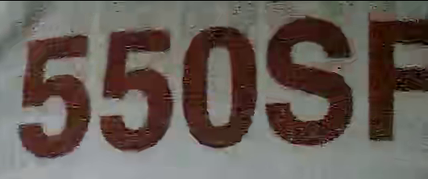
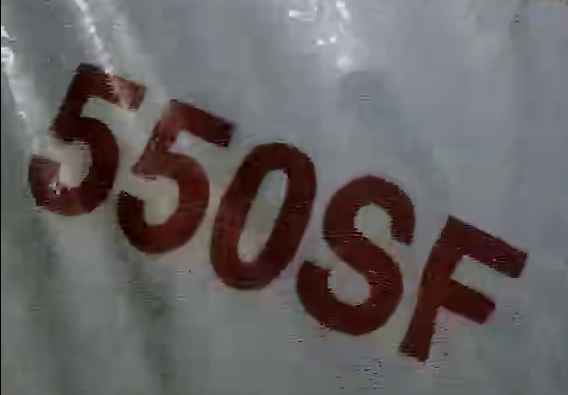
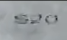
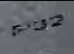

# ALPHA_OCR_ATTN

## Installation
Install package
```bash
pip install git+ssh://git@github.com/phvan2312/ALPHA_OCR_ATTN.git@fix_gpu_speed
```

## Usage
 
```python
from alpha_ocr.ocr_infer import OCRInferenceModel
saved_model_fn = "where_is_your_saved_model_path"

ocr_model = OCRInferenceModel(saved_model=saved_model_fn,debug_mode=False, mode='cuda')

# testing with specific image path
image_fn = "where_is_your_image_path"

import cv2
results  = ocr_model.predict(cv2.imread(image_fn))

print (results)

```

### Pretrained weights
You can download pretrained weights via this link: https://drive.google.com/open?id=1NIov8063bsvJZmgIwVRe60kXXdM6Ze0I

### Some examples
| demo images | Prediction |
| ---         |     ---      |
|     |   550sf   |
|       |    550sf    |
|   |   s20   |
|   |   p32   |
